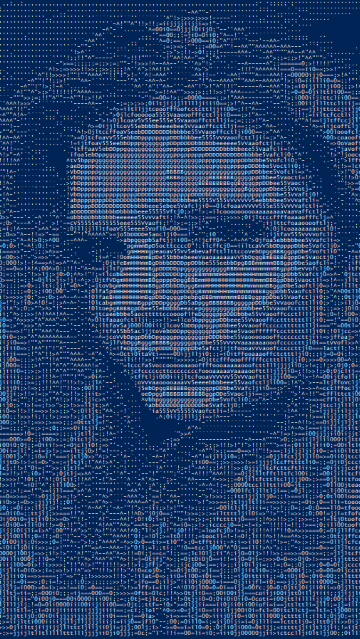

# Kezdő programozás

A kurzus célja, hogy a résztvevők betekintést nyerjenek a programozás világába.
Megismerkedünk az programozói gondolkodásmóddal és áttekintjük az alapvető
programozási eszközöket. A tanfolyam **nem** igényel semmiféle előismeretet, a
tananyag ennek tükrében került összeállításra, sok-sok gyakorló példán mélyítjük
el az új ismereteket. Törekszünk arra -szem előtt tartva, hogy ez egy új világ
lesz számodra-, hogy a bemutatott és megtanult dolgok, a lehető legkevésbé legyenek
bármiféle programozási nyelvhez kötve, azt csupán mint eszközt használjuk.

A jelentkezésnél lehetőség van többféle programozási nyelvet megjelölni, hogy
mindenki -*előismeret*, *hallás*, vagy *ajánlás* révén-, a számára legszimpatikusabb
nyelvvel vághasson bele a tanulásba. Ezt a listát folyamatosan igyekszünk bővíteni.

A tananyag felépítése miatt nem kell aggódnod, ha valamikor nem tudsz jelen lenni,
bármikor pótolhatod egy másik csoportnál a kimaradt alkalmat, akkor is ha az a
csoport épp egy másik nyelvet használ. A leadott anyag teljesen ugyan az, neked
csak az általad tanult nyelvi megvalósítást kell átnézned, amit itt meg is fogsz
találni! :)

### Tematika:

1.  Adatok típusai, változók, I/O
2.  Logikai típus, elágazás
3.  Ciklusok
4.  Függvények, eljárások
5.  Összetett típusok(OOP)
6.  Összetett típusok(OOP) + modularizáció
7.  File-hibakezelés
8.  Projekt
9.  Projekt
10. Projekt

### Projekt

A kurzus folyamán megszerzett tudást arra fogjuk használni, hogy megvalósítsunk
egy képkonvertáló alkalmazást az "asciify"-t. A projekt elkészítéséhez minden
tudásunkra szükség lesz (itt-ott picit többre is), de nagyon hasznos megtapasztalni
az utat egy komplettebb program tervezésétől kezdve a megvalósításon át egészen
a használatának öröméig.

### asciify

| **Előtte**                        | **Utána**                    |
|:---------------------------------:|:----------------------------:|
|        |  |

*Megj.*: a kapott kép részletessége beállítás és felbontás függő
